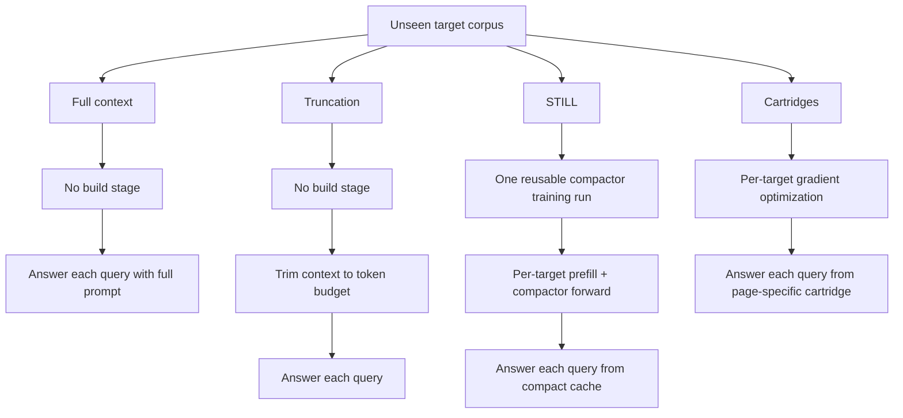
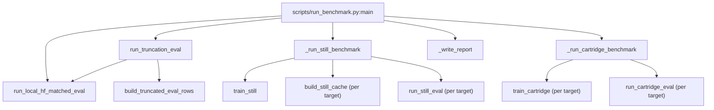
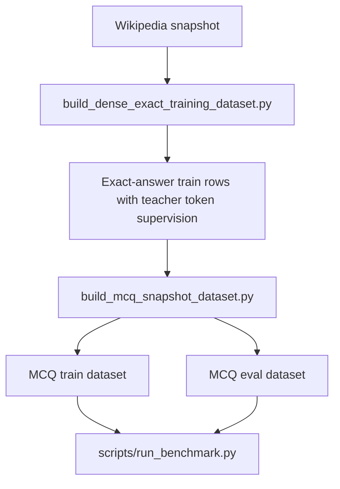

# STILL

The new frozen-Qwen3-4B full-context/evidence-teacher KV OPD integration is documented in
[docs/opd_integration.md](docs/opd_integration.md). Its default comparison command runs a
one-step pre-training smoke; the original offline MCQ benchmark remains below.

The full-KV / fixed-teacher forward-KL / ordinary OPD baseline comparison and
the four-benchmark readiness audit are documented in
[docs/baselines_and_benchmarks.md](docs/baselines_and_benchmarks.md).
Use `scripts/run_opd_comparison.py --methods still full` for the three baselines;
this excludes evidence-teacher training.

This repository is a single-GPU reproduction of Baseten's STILL idea for neural KV-cache compaction, benchmarked against:

- full-context inference
- truncation
- cartridges

The final validated branch in this repo is an MCQ benchmark on `Qwen/Qwen3-4B` with:

- `1024` compact tokens / latents
- `115` training Wikipedia articles
- `8` MCQ training questions per training article
- `20` held-out Wikipedia articles
- `10` held-out MCQ questions per held-out article

That means:

- STILL training set size: `115 * 8 = 920` rows
- held-out evaluation size: `20 * 10 = 200` rows

The benchmark is intentionally cost-model-aware. STILL is treated as:

- one reusable training run
- one cheap compact-cache build per unseen target corpus
- fast per-query inference after the cache is built

Cartridges is treated as:

- no reusable training stage
- one expensive optimization run per unseen target corpus
- then fast per-query inference on that optimized corpus-specific cartridge

The reference cartridges baseline used here is:

- [shreyansh26/cartridges](https://github.com/shreyansh26/cartridges)

## Final Results

These are the numbers from the tracked final report in [comparison.md](outputs/final_mcq_benchmark/runs/final_mcq_v1/report/comparison.md) and [summary.json](outputs/final_mcq_benchmark/runs/final_mcq_v1/report/summary.json).
The published benchmark reuses the best STILL checkpoint found during the seed sweep, while the default `scripts/run_benchmark.py` retraining settings now match that best configuration.
The metric audit that explains the latency semantics and the `2 vs 6` decode-token discrepancy is in [docs/benchmark_latency_audit.md](docs/benchmark_latency_audit.md).

Definitions:

- `Mean query total latency` = amortized end-to-end per-question cost, including method-specific preparation when a method has one
- `Mean online query latency` = per-question question-answering time after the method-specific artifact is already ready
- for `full_context` and `truncation`, `mean online query latency` still includes prompt prefill for that question because there is no reusable artifact
- for `STILL` and `cartridge`, `mean online query latency` starts after the compact cache artifact already exists
- `Mean target preparation` = one-time cost to prepare one held-out corpus/page before answering its benchmark questions
- `Mean target total seconds` = target preparation + all `10` benchmark questions for one target
- `One-time reusable training` = reusable compactor training, only applicable to STILL

| Method | Accuracy | Compression vs Full | Mean Query Total Latency (ms) | Mean Online Query Latency (ms) | Mean Target Preparation (s) | Mean Target Total Seconds | One-Time Reusable Training (s) |
| --- | ---: | ---: | ---: | ---: | ---: | ---: | ---: |
| `full_context` | `0.950` | `1.000` | `178.388` | `178.388` | `0.000` | `1.784` | `n/a` |
| `truncation_1024` | `0.775` | `2.458` | `133.736` | `133.736` | `0.000` | `1.337` | `n/a` |
| `still_1024_ce_only` | `0.315` | `2.721` | `102.479` | `84.517` | `0.180` | `1.025` | `274.215` |
| `cartridge_1024` | `0.885` | `2.736` | `2537.627` | `189.468` | `23.482` | `25.376` | `n/a` |

Interpretation:

- STILL is still the fastest method both after preparation and on the amortized end-to-end per-query metric in this benchmark.
- Truncation is slower online because it still reprefills roughly `1024` context tokens per question, while STILL only runs the short continuation against a prebuilt compact cache.
- Full-context and truncation also generate longer MCQ outputs than the normalized letter suggests. On inspecting, they produced six-token strings of the form `<think> ... </think> LETTER <|im_end|>`, while STILL typically produced just `LETTER <|im_end|>`.
- The best STILL checkpoint found so far improves held-out accuracy from `0.285` to `0.315`, but cartridges is still much stronger on quality in this benchmark and pays for that by optimizing separately for every held-out page.
- STILL currently proves the systems advantage more clearly than the quality advantage.

## What This Repo Implements

This codebase keeps only the final benchmark flow:

1. Build or reuse a fixed Wikipedia snapshot.
2. Build exact-answer supervision rows.
3. Convert those rows into deterministic MCQ datasets.
4. Run one benchmark entrypoint that evaluates:
   - full context
   - truncation
   - STILL
   - cartridges
5. Write one final comparison report with aligned metrics.

Important retained scripts:

- [`scripts/prepare_wikipedia_snapshot.py`](scripts/prepare_wikipedia_snapshot.py)
- [`scripts/build_dense_exact_training_dataset.py`](scripts/build_dense_exact_training_dataset.py)
- [`scripts/build_mcq_snapshot_dataset.py`](scripts/build_mcq_snapshot_dataset.py)
- [`scripts/run_benchmark.py`](scripts/run_benchmark.py)

Important retained library modules:

- [`src/still/core/still.py`](src/still/core/still.py)
- [`src/still/core/cache.py`](src/still/core/cache.py)
- [`src/still/train/still.py`](src/still/train/still.py)
- [`src/still/eval/baseline.py`](src/still/eval/baseline.py)
- [`src/still/eval/truncation.py`](src/still/eval/truncation.py)
- [`src/still/eval/still.py`](src/still/eval/still.py)
- [`src/still/benchmarks/text_benchmark.py`](src/still/benchmarks/text_benchmark.py)

## STILL vs Cartridges

The core difference is where optimization happens.

### Cartridges

Cartridges learns a compact KV artifact for one specific target corpus. In this repo's final comparison, the reference `cartridges` implementation optimizes a separate compact cache for each held-out page.

Operationally:

- input: one held-out page plus its teacher-supervised rows
- trainable object: compact keys and values for that page
- frozen object: the base LLM
- output artifact: one page-specific cartridge

So cartridges has:

- no reusable training stage
- a large per-target optimization cost
- good quality because it fits each target corpus directly

### STILL

STILL learns a reusable mapping from a full teacher KV cache to a smaller compact cache.

Operationally:

- input during training: many full caches from many training pages
- trainable object: the compactor weights
- frozen object: the base LLM
- reusable output artifact: one compactor checkpoint
- per-target runtime artifact: one compact cache built by a single forward pass

So STILL has:

- one reusable training stage
- a very small per-target build stage
- much better runtime scaling across many unseen corpora
- a current quality gap in this repo's final benchmark

## The Math

### KV Cache Size

For a dense decoder KV cache with:

- `T` tokens
- `L` layers
- `H_kv` KV heads
- `d` head dimension
- `b` bytes per scalar

the canonical KV footprint is:

```text
KV_bytes = T * L * H_kv * d * 2 * b
```

The factor `2` is for keys plus values.

This repo uses that formula in [`src/still/eval/common.py`](src/still/eval/common.py) to report a method-independent KV size.

### Cartridges Objective

For one target corpus `s`, cartridges directly optimizes compact cache parameters:

```text
C_s = {K_s^c, V_s^c}
```

against teacher supervision on that same corpus. In the reference implementation used here, the loss is a sparse distillation loss over answer tokens:

```text
L_cartridge(C_s)
  = mean over examples and answer positions
    [ - sum_v w_teacher(v) * log p_theta(v | query, C_s) ]
```

where:

- `theta` is the frozen base model
- `w_teacher(v)` is the sparse teacher distribution stored from the full-cache teacher run
- `C_s` is optimized separately for every target corpus `s`

This is why cartridges has no reusable training cost but a very large per-target preparation cost.

### STILL Architecture

At transformer layer `l`, STILL starts from the full cache:

```text
K_l in R^(H x T x d)
V_l in R^(H x T x d)
```

and produces:

```text
C_l^K in R^(H x t x d)
C_l^V in R^(H x t x d)
beta_l in R^(H x t)
```

with `t << T`.

The latent variable `Z_l` means "the learned latent state used to summarize layer `l`'s full KV cache."

In this repo:

- `Z_l^(0)` = the initial learned latent table before reading the cache
- `Z_l^(1)` = the latent state after perceiver block 1
- `Z_l^(2)` = the latent state after perceiver block 2

The superscripts `0`, `1`, and `2` are stage indices, not powers.

The flow used in this repo follows the blog's RoPE-aware recipe:

```text
1. Unrotate cached keys:
   K'_l = RoPE^{-1}(K_l)

2. Concatenate unrotated keys and values:
   X_l = [K'_l ; V_l]

3. Initialize learned latents:
   Z_l^(0)

4. Run perceiver block 1:
   Z_l^(1) = PerceiverBlock_1(Z_l^(0), X_l)

5. Run perceiver block 2:
   Z_l^(2) = PerceiverBlock_2(Z_l^(1), X_l)

6. Project final latents to compact cache tensors:
   C_l^K = RoPE(W_K Z_l^2, latent_positions)
   C_l^V = W_V Z_l^2
   beta_l = W_beta Z_l^2
```

Two implementation details matter here:

- the keys are unrotated before compaction and rerotated afterward
- the beta term is added as an additive attention bias, not as a boolean mask

`beta_l` is important because it lets the compactor adjust *attention preference*
over the compact slots after compression. It does not store new factual content.
Instead, it shifts the attention logits so the frozen model can learn which
latent slots should be emphasized or suppressed when reading the compact cache.

### STILL Training Objective

The general training objective in this repo is:

```text
L_still
  = lambda_KL * KL(P_teacher || Q_student)
  + lambda_CE * CE(y, Q_student)
```

where:

- `P_teacher` is the frozen full-cache teacher distribution
- `Q_student` is the frozen model run with the compact STILL cache
- `y` is the supervised target answer

The best final branch in this repo is not the exact blog setting. The best benchmarked STILL run here uses:

```text
lambda_KL = 0
lambda_CE = 1
```

on deterministic MCQ letter prediction, with:

```text
latents = 1024
steps = 300
learning_rate = 2e-5
seed = 1
validation_examples = 32
validation_interval = 50
```

That is why the final method name is `still_1024_ce_only`.

## STILL Architecture Flow


## Benchmark Cost Model



## What Happens When `run_benchmark.py` Runs

The benchmark entrypoint is:

```bash
source .venv/bin/activate
CUDA_VISIBLE_DEVICES=0 python scripts/run_benchmark.py \
  --device cuda:0 \
  --run-name final_mcq_best_seed1
```

The default prepared datasets live under:

```text
outputs/final_mcq_benchmark/runs/final_mcq_v1/prepared/
```

and the benchmark writes its outputs under:

```text
outputs/final_mcq_benchmark/runs/<run_name>/
```

At a high level, `run_benchmark.py` runs the same held-out MCQ set through four methods:

1. full context
2. truncation
3. STILL
4. cartridges

Then it summarizes accuracy, compression, latency, and target-preparation costs into the final report.

### Call Graph



### Short Execution Flow

#### 1. [`scripts/run_benchmark.py`](scripts/run_benchmark.py)

`main()`:

1. validates the prepared dataset files
2. runs full-context evaluation
3. runs truncation evaluation
4. runs the STILL branch
5. runs the cartridges branch
6. writes the final markdown and JSON reports

#### 2. Full-context baseline

[`src/still/eval/baseline.py`](src/still/eval/baseline.py): `run_local_hf_matched_eval()`:

- builds the full prompt with the entire context included
- runs the frozen Hugging Face model directly
- records the baseline quality and KV-byte accounting

#### 3. Truncation baseline

[`src/still/eval/truncation.py`](src/still/eval/truncation.py):

- clips each context to the token budget
- reuses the same evaluator as the full-context baseline

#### 4. STILL path

[`scripts/run_benchmark.py`](scripts/run_benchmark.py): `_run_still_benchmark()`:

- trains the reusable compactor with [`train_still()`](src/still/train/still.py)
- builds one compact cache per held-out page with [`build_still_cache()`](src/still/train/still.py)
- answers held-out questions from the compact cache with [`run_still_eval()`](src/still/eval/still.py)

The compression itself happens in [`src/still/core/still.py`](src/still/core/still.py), where each layer:

1. unrotates the full keys
2. concatenates unrotated keys with values
3. runs two perceiver blocks over learned latents
4. projects final latents into compact keys, compact values, and beta
5. rerotates the compact keys

#### 5. Cartridge path

[`scripts/run_benchmark.py`](scripts/run_benchmark.py): `_run_cartridge_benchmark()` loops over held-out targets and for each target:

1. calls `cartridges.train.cartridge.train_cartridge()`
2. optimizes one page-specific compact cache
3. calls `cartridges.eval.cartridge.run_cartridge_eval()`
4. normalizes predictions into the same scoring format as the other methods

This is why cartridges preparation is expensive in the final report. It is not a reusable training phase. It is a repeated per-target optimization phase.

#### 6. Report writing

[`scripts/run_benchmark.py`](scripts/run_benchmark.py): `_summarize_method()` and `_write_report()`:

- compute accuracy
- compute canonical KV size and compression ratio
- separate per-query latency from per-target preparation
- separate STILL reusable training from per-target build
- write both machine-readable and markdown reports

## Dataset-Building Flow

The benchmark uses prepared MCQ datasets. If you want to rebuild them, the flow is:



### [`build_dense_exact_training_dataset.py`](scripts/build_dense_exact_training_dataset.py)

This script:

- reads the fixed train or held-out snapshot entries
- optionally limits to `max-experiments`
- generates extractive question/answer seeds for each selected article
- aligns the answer rows to exact answers
- records teacher token supervision for those answers

`--max-experiments 115` means:

- take the first `115` snapshot entries from the chosen split
- build training data only for those `115` articles

In the final STILL branch that produces:

- `115` train articles
- `8` questions per article
- `920` total training rows

### [`build_mcq_snapshot_dataset.py`](scripts/build_mcq_snapshot_dataset.py)

This script:

- reads the exact-answer rows
- converts them into deterministic 4-option MCQs
- uses local plus global answer pools for distractors
- writes:
  - `combined_train_dataset.jsonl`
  - `combined_eval_rows.jsonl`
  - `mcq_manifest.json`

## Commands

### 1. Prepare the Python environment

```bash
uv venv .venv
source .venv/bin/activate
uv pip install -e .
```

### 2. Optional: build the Wikipedia snapshot

```bash
source .venv/bin/activate
CUDA_VISIBLE_DEVICES=0 python scripts/prepare_wikipedia_snapshot.py \
  --output-dir data/wikipedia_snapshot_20231101_en \
  --data-root data
```

### 3. Optional: rebuild the dense exact datasets

STILL train split:

```bash
source .venv/bin/activate
CUDA_VISIBLE_DEVICES=0 python scripts/build_dense_exact_training_dataset.py \
  --snapshot-root data/wikipedia_snapshot_20231101_en \
  --split train \
  --max-experiments 115 \
  --questions-per-article 8 \
  --base-url http://127.0.0.1:8005/v1 \
  --api-key still-local \
  --device cuda:0 \
  --output-root outputs/final_mcq_benchmark/runs/final_mcq_v1/prepared/still_dense_exact
```

Cartridge held-out split:

```bash
source .venv/bin/activate
CUDA_VISIBLE_DEVICES=0 python scripts/build_dense_exact_training_dataset.py \
  --snapshot-root data/wikipedia_snapshot_20231101_en \
  --split heldout \
  --max-experiments 20 \
  --questions-per-article 8 \
  --base-url http://127.0.0.1:8005/v1 \
  --api-key still-local \
  --device cuda:0 \
  --output-root outputs/final_mcq_benchmark/runs/final_mcq_v1/prepared/cartridge_dense_exact
```

### 4. Optional: rebuild the MCQ datasets

STILL MCQ dataset:

```bash
source .venv/bin/activate
CUDA_VISIBLE_DEVICES=0 python scripts/build_mcq_snapshot_dataset.py \
  --snapshot-root data/wikipedia_snapshot_20231101_en \
  --train-exact-root outputs/final_mcq_benchmark/runs/final_mcq_v1/prepared/still_dense_exact \
  --eval-exact-path outputs/final_mcq_benchmark/runs/final_mcq_v1/prepared/eval_exact/combined_eval_rows.jsonl \
  --output-root outputs/final_mcq_benchmark/runs/final_mcq_v1/prepared/still_mcq \
  --device cuda:0
```

Cartridge MCQ dataset:

```bash
source .venv/bin/activate
CUDA_VISIBLE_DEVICES=0 python scripts/build_mcq_snapshot_dataset.py \
  --snapshot-root data/wikipedia_snapshot_20231101_en \
  --train-exact-root outputs/final_mcq_benchmark/runs/final_mcq_v1/prepared/cartridge_dense_exact \
  --eval-exact-path outputs/final_mcq_benchmark/runs/final_mcq_v1/prepared/eval_exact/combined_eval_rows.jsonl \
  --output-root outputs/final_mcq_benchmark/runs/final_mcq_v1/prepared/cartridge_mcq \
  --device cuda:0
```

### 5. Run the final benchmark

This default run retrains STILL with the best training hyperparameters found so far:

- `1024` latents
- `300` steps
- `2e-5` learning rate
- `seed=1`
- `32` validation examples
- `50` validation interval

To reproduce the published report numbers exactly, reuse the best checkpoint instead of retraining:

```bash
source .venv/bin/activate
CUDA_VISIBLE_DEVICES=0 python scripts/run_benchmark.py \
  --device cuda:0 \
  --run-name final_mcq_best_seed1 \
  --skip-still-train \
  --still-compactor-path outputs/still_debug/runs/still_selector_debug_gpu4_exact_cefix_seed1_300/train/still_compactor.pt
```

### 6. Read the final report

- [comparison.md](outputs/final_mcq_benchmark/runs/final_mcq_v1/report/comparison.md)
- [summary.json](outputs/final_mcq_benchmark/runs/final_mcq_v1/report/summary.json)

## Current Limitations

- STILL clearly wins on runtime cost structure in this repo.
- STILL does not yet preserve enough quality to beat truncation or cartridges on the final MCQ benchmark.
- The final best branch here is MCQ CE-only, which is narrower than the broader continual-memory story in the Baseten blog.

## Reference

Baseten research blog:

- [Towards Infinite Context Windows: Neural KV Cache Compaction](https://www.baseten.co/research/towards-infinite-context-windows-neural-kv-cache-compaction/)

```bibtex
@misc{o'neill2026still,
  author       = {O'Neill, Charles},
  title        = {Towards Infinite Context Windows: Neural {KV} Cache Compaction},
  year         = {2026},
  month        = April,
  day          = {1},
  howpublished = {Baseten Research},
  url          = {https://www.baseten.co/research/towards-infinite-context-windows-neural-kv-cache-compaction/},
}
```
